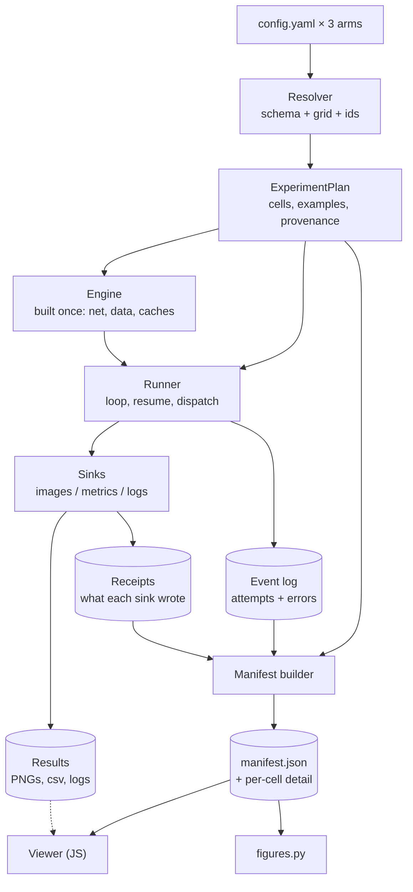
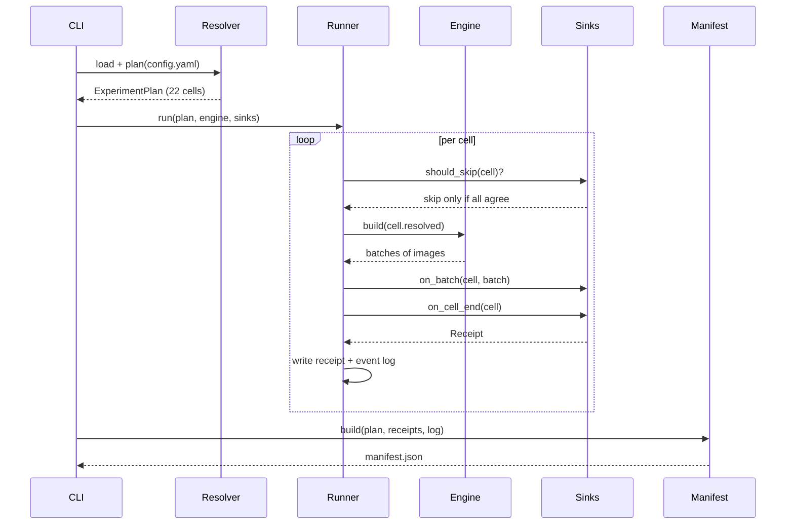

# PPG Sweep — Target Architecture

The design. For how to get there from the current repo, see [`migration.md`](migration.md).

## Purpose

This document defines the target architecture for the `push-pull-guidance` sweep and visualisation stack, and the route from the current repo to it.

The target in one paragraph: one resolver turns `config.yaml` into an **ExperimentPlan** of content-addressed cells. One runner walks that plan and streams each cell's output to a set of **sinks** (images, metrics, logs). Everything written lands under a `cell_id`. One **manifest** file describes what exists on disk, and the viewer reads only that manifest — never the filesystem layout.

The design constraint throughout is that this is a single-author research repo with a preprint pending. It optimises for two things: being unable to silently produce wrong results, and being legible to its author six months from now. It does not optimise for scale, extensibility, or multiple contributors.

Decided here: cell identity, the four durable artifacts, layer boundaries, module layout, and migration order. Left open: the three questions in the final section, which change the design and still need answers.

## Vocabulary

Three words below are load-bearing, and none of them are standard ML terms. All three name code that already exists in this repo — it is just not separated out.

**Runner** — the `for` loop over parameter settings. It picks the next cell, decides whether to skip it, and asks the model for images. It never writes a file. Today this loop is written twice: `Gallery.generate` and the body of `metrics_sweep.main`.

**Sink** — something the loop hands each result to, which decides what to store and where. Today this code sits *inside* those two loops: `_save_images`, `_save_snapshots`, `_save_logs` and the manifest append in one; `_append_csv_row` in the other. The name is borrowed from stream processing (source → transform → sink) and nothing hangs on it.

Separating the two means writing the loop once and choosing sinks per invocation:

```python
run(plan, sinks=[ImageSink(out)])                    # what sweep.py does today
run(plan, sinks=[MetricsSink(csv)])                  # what metrics_sweep.py does today
run(plan, sinks=[ImageSink(out), MetricsSink(csv)])  # both, generating each image once
```

**Manifest** — a catalogue of what was produced and where it sits, so that no reader has to know the directory layout. Today this is `manifest.json`, doing about half the job. To display one snapshot the viewer currently has to know four separate facts: that images live in the cell directory, that snapshots sit in a `snapshots/` subdirectory, that they are named `img_{i}_step_{s}.png`, and that `i = example_idx × n_seeds + seed_idx`. Those four facts are defined in Python and re-implemented in JavaScript. With a complete manifest the viewer looks up one string and knows none of them.

## Design principles

Five rules generate every other decision in this document. Where a later section seems arbitrary, it is downstream of one of these.

1. **One resolver, many consumers.** `config.yaml` is parsed and validated in exactly one place. Anything that needs to know what the experiment is reads the resolved plan, never the YAML. Two parsers always drift; this repo already has two that have.
2. **Identity is content, not position.** A cell is named by a hash of its resolved parameters, not by its ordinal index in the Cartesian product. Adding one value to one axis must not renumber anything.
3. **The manifest is the interface.** Producers write files and register them in a manifest. Consumers read the manifest. No consumer reconstructs a path from a naming convention, because a convention known in two languages is a convention that will break silently.
4. **Describe what exists, not what was requested.** The viewer's capabilities are derived from the manifest, not declared in the config. Cells fail, runs get interrupted, metrics arrive later. A spec written from intent will promise panels that have no data.
5. **Data is the durable artifact; renderings are disposable.** Images, metric rows and step logs are kept. Plots, HTML and figures are regenerated from them at will, by whichever renderer suits the destination.

## The spine: cell identity

A **cell** is one point in the parameter grid, and `cell_id` is the hash of its resolved configuration. This single decision is what lets heterogeneous storage — PNGs, a CSV, JSON logs — behave as one dataset.

Today a cell is identified by its ordinal index in the Cartesian product. Directories are named `0007_decomposed_6.46_inf`; the metrics CSV keys rows on `cell_idx`. Add one value to one `values:` list and every index after it shifts. The manifest survives this because `_validate_manifest` re-keys on `flat_cell`, but the CSV does not: `_read_done_indices` reads `cell_idx`, so resuming a metrics run after any config edit mixes results from different parameter settings into one table.

A content hash fixes this and buys three things at once: exact resume, config edits that invalidate only the cells that actually changed, and a **join key** — images and metrics for the same cell line up for free, with no extra plumbing.

Four artifacts hang off that spine. Each has one writer and a stable shape.

| Artifact | Written by | Read by | Holds |
| --- | --- | --- | --- |
| Config | the user | resolver | The YAML sweep definition, unchanged from today |
| Plan | resolver | runner, manifest builder | Resolved cells, axis order, provenance |
| Results | sinks | viewer, figures, analysis | PNGs, metric rows, step logs, all under `cell_id` |
| Manifest | manifest builder | viewer, figures | What exists, where, and with every path resolved |

Identity has **three levels**, because the viewer compares across runs as well as within one.

```python
@dataclass(frozen=True)
class Cell:
    run_id:   str            # which sweep: pushpull | pixel | sdedit
    cell_id:  str            # hash of resolved config, unique within a run
    coords:   dict           # swept values only — grid layout in the viewer
    resolved: SweepConfig    # complete config — what the model runs at

@dataclass(frozen=True)
class ExampleKey:
    example_id: str          # stable across runs: source image + source/target label
    seed:       int
```

`coords` has to exist separately from `resolved`. The viewer's row and column selectors need to know which parameters vary and in what order, and cannot recover that from a pile of complete configs.

`ExampleKey` is the join axis **across** runs, as `cell_id` is the join axis within one. Today an image is `img_{i}.png` where `i = example_idx * n_seeds + seed_idx`, and `example_idx` is just a position in `my_samples.yaml`. That happens to line up across the three survey runs because their `examples` blocks are identical, but nothing enforces it — change `n_entries` in one config and every cross-run comparison silently shifts by one image. The concept already exists in the metrics path as `MetadataIterable(class_id, example_id)`; it needs promoting to the storage key.

Storage therefore keys on `runs/<run_id>/cells/<cell_id>/`, with images named by `ExampleKey` rather than by ordinal position.

**The baseline is a cell.** It is the configuration with guidance removed, so giving it a `cell_id` like any other deletes `_run_baseline` — roughly forty lines of bespoke caching with its own `baseline_meta.json`, duplicating what resume already does. It then flows through the sinks and lands in the manifest for free.

It also answers a question you cannot currently check. The three survey arms share one `baseline_dir`, and if their baseline configurations really are identical they hash alike and are computed once. If they do not hash alike, that is worth knowing before the arms are compared.

## Cross-run comparison

The three survey runs sweep **the same 22-value ladder bound to a different parameter each time**. That correspondence is semantic, nothing can infer it, and so it has to be declared.

| Run | Strength knob | Path in config | Other differences |
| --- | --- | --- | --- |
| `pixel` | guidance strength | `ppg.gate.nu` | quadratic gate, no maps |
| `pushpull` | guidance strength | `ppg.gate.nu` | heaviside gate, interpolation + VAE maps |
| `sdedit` | noise level | `solver.sigma_max` | no `ppg` block at all |

Everything else is already matched by hand: identical `examples` blocks (`my_samples.yaml`, `n_entries: 50`, `n_seeds: 9`, `seed: 0`), identical `snapshots.steps`, identical solver settings, one shared `baseline_dir`, and the identical 22-element value list `[80.0, 66.93, ..., 0.6, 0.0]`.

So the axes are **not** unionable. `ppg.gate.nu` and `solver.sigma_max` are the same conceptual quantity under two names, and `sdedit` has no `ppg` block to align on. Rather than have each config restate the correspondence, the method declares it: every method names the path of its own strength knob, so the alias is a property of the method instead of something kept in sync by hand.

```yaml
# pushpull arm
method:
  type: pushpull        # strength_axis = "gate.nu"
  gate:
    type: heaviside
    nu: {values: [80.0, 66.93, ..., 0.6, 0.0]}

# sdedit arm — the same ladder, bound to a solver field instead
solver:
  sigma_max: {values: [80.0, 66.93, ..., 0.6, 0.0]}
method:
  type: sdedit          # strength_axis = "solver.sigma_max"
```

Three views fall out of that, and they are the reason to do any of this:

1. **Matched-strength image row.** Fix an `ExampleKey` and a rung of the ladder; show baseline, pixel, pushpull and sdedit side by side. This is the qualitative figure the paper wants.
2. **Metric against strength, one line per arm.** Content similarity or FD on the y-axis, the shared `strength` axis on the x, one line per run. This is the quantitative figure the paper wants, and it is impossible without both the alias and the `cell_id` join.
3. **Per-step diagnostics overlaid within a run.** Score norms across all 22 rungs on one chart, which no collection of per-cell PNGs can show.

**The comparability contract.** The manifest records a hash of the example set (`example_id` list plus `n_seeds` plus seed) per run. The viewer overlays two runs only when their hashes match, and says so plainly when they do not. Without this, changing `n_entries` in one config produces a comparison chart that looks fine and is wrong — the visual analogue of the CSV resume bug, and harder to notice.

**How a run says which group it is in.** `compare.group` is written in each arm's config — three files, the same string — and that is the only place it is declared by hand. From there it propagates into each run's `plan.json`, and the manifest builder emits one manifest per group it finds. Runs from two different groups under one parent directory get a manifest each rather than being mixed.

The grouping could instead be inferred from `output_dir`, since the three arms already write to `sweeps/survey/<arm>`. It is declared rather than inferred for the same reason nothing else here recovers meaning by parsing a path: it breaks silently when a directory moves, and it cannot express two groups sharing a parent. Declaring it also makes each config self-describing — you can read `pixel.yaml` alone and know what it belongs to.

**`arm` is the label a run carries in comparison views**: the legend entry on the metric chart, the column header in the matched-strength row. It **defaults to the method type**, because the three survey arms differ exactly by method and writing `arm: pushpull` beside `method: {type: pushpull}` states one fact in two places that can then drift. Set it explicitly only when the method cannot tell two runs in a group apart — `arm: pushpull-vae` against `arm: pushpull-interp`.

Keep it distinct from `run_id`, which is easy to conflate because the two coincide in every one of your current configs. `run_id` identifies *the run* and defaults to the last component of `output_dir`; `arm` identifies *what it is an instance of*. Several runs may share an arm; no two may share a `run_id`.

## Target architecture

Five layers, each depending only on the one below it. The rule that matters: **the arrows never point backwards**, and nothing skips a layer to reach the filesystem.



The **resolver** owns the schema and imports no torch. The **plan** is pure data — cells, the example set, provenance — so building or inspecting it needs no GPU, which is what makes `--dry-run` and the comparability hash cheap. The **engine** holds everything expensive that is built once: the network, encoded example tensors, the DDIM precompute, the projection caches. The **runner** owns the loop and knows nothing about what happens to output. The **sinks** own storage and know nothing about the grid. The **manifest builder** reads the plan, the receipts and the event log — never the results directory itself — and writes the catalogue. The **viewer** and `figures.py` are peers: two renderers over one manifest, neither aware of the other. The dotted edge is the viewer fetching the actual images, at URLs the manifest gave it.

The important separations, stated as prohibitions:

- The **model layer** (pipeline setup, maps, dynamics) never touches the filesystem or the config's output paths. It receives a `resolved` config and returns images.
- The **runner** never writes a file. It emits events.
- The **viewer** never constructs a path. Every path it needs is a literal string in the manifest.
- The **config** never declares viewer panels. Panels are derived from what the manifest contains.

That last one deserves emphasis because it is the least obvious. The viewer already does this correctly for one case — `baseline: { on: baselines.length > 0 }` — and hardcodes the rest. The target simply applies the existing pattern to timeline, diagnostics and metrics, computed in Python at manifest-build time.

## Module layout

One importable package replaces the loose top-level scripts. This is a net simplification: the repo currently has `sweep.py`, `generate.py`, `util.py` and `calculate_metrics.py` at the root, plus `sweeper/`, `diagnostics/`, `torch_utils/` and `edm/`.

```
ppg_sweep/
  core/                   # generic — knows nothing about diffusion
    grid.py               # axes -> cells, cell_id hashing
    plan.py               # ExperimentPlan, Cell, ExampleKey
    runner.py             # the loop: resume, dispatch, error handling
    sinks.py              # Sink protocol, ImageSink, SnapshotSink, LogSink
    paths.py              # THE path conventions — single source of truth
    manifest.py           # build + read the manifest
    presentation_spec.py  # manifest -> presentation spec
  diffusion/              # everything that knows about diffusion
    schema.py             # engine + method unions
    loader.py             # THE loader: yaml -> Config
    engine.py             # build_engine(plan) -> Engine
    pipeline.py           # sd / edm / edm2 construction
    maps.py               # build_map_layers + ProjectionCache
    datasets.py           # WHICH examples: paths, labels, seeds — no torch
    generate.py           # dynamics, solvers, input iterables
    util.py               # Logger, load_images, edm_sigmas
    sinks.py              # MetricsSink
    figures.py            # matplotlib renderer for the paper
    guidance.py           # thin re-export of the ppg submodule
    methods/              # pushpull, pixel, sdedit, none
    ppg/                  # submodule — the PPG algorithm itself
    edm/                  # NVlabs edm / edm2 — pinned, unmodified
    torch_utils/          # NVlabs, locally modified — kept alongside edm's
    calculate_metrics.py  # NVlabs, forked — see Code ownership
  cli.py                  # run | metrics | manifest | view

viewer/                   # generic — reads a manifest
  index.html
  viewer.js
  data.js                 # the ONLY module that knows the manifest shape
  plots.js
  viewer.css

diagnostics/              # out of scope
demo/  data/
sweep.py                  # shim -> cli
metrics_sweep.py          # shim -> cli
```

**One package, two halves, and one import rule: `core/` may not import from `diffusion/`.** That single constraint is what makes the layering structural instead of aspirational — if the runner ever reaches for a gate parameter, the import fails. A short test walking the imports of `core/` enforces it, or `import-linter` if you would rather use a tool.

The domain half is called `diffusion/` rather than `ppg/` because the PPG submodule lives inside it. `ppg_sweep/diffusion/ppg/` is the algorithm; naming its parent `ppg` as well would make every import a puzzle.

Moving the inherited code under `diffusion/` costs two mechanical things. `.gitmodules` gets a new path (`path = ppg_sweep/diffusion/ppg`), and imports need a one-time rewrite: `from edm.dnnlib.util import …` becomes `from ppg_sweep.diffusion.edm.dnnlib.util import …`. The submodule's own path becomes `ppg_sweep.diffusion.ppg.ppg`, which is worth hiding behind a one-line re-export in `diffusion/guidance.py` instead of writing at twenty call sites.

Both copies of `torch_utils/` are kept. They are not duplicates: the top-level copy carries local modifications, so neither can be dropped in favour of the other. Both move under `diffusion/` as they are.

The line falls exactly where the layer diagram already puts it. Everything touching the grid, storage and cataloguing is generic; everything touching diffusion, guidance or ImageNet is not. `core/` needs one thing from the domain: that the config is a pydantic model it can walk and serialise deterministically — which `extract_axes` already assumes by recursing over `model_fields`.

**Two subpackages, not two installable packages.** There is no second consumer yet, and a "generic" boundary drawn without one is usually drawn in the wrong place; you find out what is really generic by having a second user, not by guessing. Two subpackages under one distribution cost nothing, and lift out cleanly later precisely because the import rule already guarantees `core/` has no domain dependencies. The viewer is the piece most likely to go first, since it already knows nothing but the manifest format.

One discipline the rule does not catch: keep domain *vocabulary* out of `core/` too. `Cell.coords` is fine; a hardcoded panel list naming "timeline" and "diagnostics" is the kind of thing that compiles cleanly and still puts diffusion assumptions in the generic half.

**What crosses the boundary.** Domain specificity reaches `core/` only as data, or as an object satisfying a protocol — never as an import.

| Direction | What passes |
| --- | --- |
| `diffusion` → `core` | the config object (any pydantic model `extract_axes` can walk), the resolved example list, an `Engine` implementation, any domain sinks |
| `core` → `diffusion` | `ExperimentPlan`, `Cell`, `ExampleKey`; `build_plan`, `cell_id` and the grid functions; the `Sink` protocol and the generic sinks; `paths`, `manifest`, the runner |

Plan construction stays in `core` even though its inputs do not. `build_plan` owns the grid expansion and the hashing, because a domain that built its own plan would duplicate both, and duplicated identity logic is the failure this design exists to prevent. What `diffusion` supplies is the parsed config and the resolved example list — deciding what an example *is* — not how cells are enumerated or named.

`cli.py` sits above both halves and is the only module importing from each: the composition root, where a concrete engine, a concrete config and a list of sinks are wired into the generic loop.

Three notes on the boundaries.

**There is no separate setup layer — setup is the engine's constructor.** `build_engine(plan)` does everything currently scattered across the two `main()` functions: loads the network, resolves and encodes the example tensors, runs the DDIM precompute and its broadcast, and warms the projection cache. That keeps the concept count down and puts the expensive one-time work in the object that holds its results.

The split between `datasets.py` and `engine.py` follows the torch boundary. *Which* examples a run uses — paths, class labels, prompts, seeds — is plan data, resolved without a GPU, so the comparability hash and `n_images` can be computed from a config alone. *Loading* those images and encoding them to latents is engine state. Today both halves live in `SweepRunner` and `main()` together, which is why neither can be inspected without CUDA.

`store/paths.py` is the only module that builds a path. Both Python and JS currently encode the snapshot naming convention independently; after this, Python encodes it once and JS not at all.

`viewer/` becomes real files. Today `sweeper/viewer.py` is 720 lines, of which roughly 217 are CSS and 402 are JavaScript inside a Python string with a `__DATA_PLACEHOLDER__` substitution. Extracting them costs nothing and buys linting, editor support and diffs that mean something.

`sweep.py` and `metrics_sweep.py` stay as three-line shims that call into `cli.py`, so the commands in the README keep working.

## Contracts

Five interfaces carry the whole design. Everything else is implementation.

**Resolver.** One entry point, and it is the only code that reads YAML.

```python
def load(path: str) -> Config: ...           # validates everything, metrics fields included
def plan(cfg: Config) -> ExperimentPlan: ...  # no torch import, no side effects
```

`plan()` being pure and cheap means `--dry-run` falls out for free: print the 36 cells and their resolved configs without touching a GPU. That is a useful check when nested variant axes make the grid hard to predict.

**ExperimentPlan.** The resolver's output, and the keystone of the design. It is also a *persisted* artifact, written to `plan.json` when a run starts — which is what lets `ppg manifest` rebuild a catalogue days later from `plan.json` plus the results directory, without re-reading the config or needing it to still say the same thing.

Its contents are best derived from its consumers rather than from the config's shape:

| Consumer | Needs from the plan |
| --- | --- |
| Runner | the ordered cells, and nothing else |
| `build_engine` | model and checkpoint, example set, seeds, batch size, snapshot steps, logging mode |
| Sinks | `cell_id`, the `ExampleKey`s, the output root |
| Manifest builder | every cell including those that never ran, axes in declared order, aliases, provenance |
| Viewer, via the manifest | axis order, aliases, arm label, title |
| `--dry-run` and the golden test | all of it, deterministically serialised |
| Comparability check | `example_set_hash`, before anything runs |

Group those fields by **role** rather than listing them flat, and separate what every cell has in common from what the sweep moves. A flat plan hides both distinctions, and it makes every cell carry a full resolved config — 22 near-identical copies of the model block, the maps and the solver.

```python
@dataclass(frozen=True)
class ExperimentPlan:
    identification: Identification  # run_id, group, arm, title
    shared:         CommonConfig    # the config every cell has in common
    varied:         Sweep           # axes, axis_aliases, cells
    data:           DataPlan        # examples, n_seeds, example_set_hash
    origin:         Origin          # git shas, checkpoint, created_at
    paths:          Paths           # output root, baseline dir

    def resolved(self, cell: Cell) -> CommonConfig:
        """shared merged with cell.coords — derived, never stored."""

@dataclass(frozen=True)
class Cell:
    cell_id: str                    # hash of the resolved config
    coords:  dict                   # the varied values, and nothing else
```

One caveat carried over from the current schema: `CommonConfig` is the same pydantic model whether it holds `Axis` objects (straight from the loader), the shared remainder, or a cell's fully concrete config, because swept fields are typed `Union[float, Axis]`. The type cannot tell you which of the three you have. Splitting it into a spec type and a concrete type would fix that; it is not worth the two extra models until something actually goes wrong.

`unflatten()` already performs the `shared` + `coords` merge today; the difference is that the shared half becomes a field of the plan rather than an argument threaded through the loop. That is what lets the engine be handed the common config directly at setup, and what turns `resolved` into a method instead of 22 stored copies of the same model block.

The grouping pays for itself at the call sites, because each consumer takes only the slice it needs:

| Consumer | Receives |
| --- | --- |
| `build_engine` | `shared`, `data`, `paths` |
| Runner | `varied`, plus the engine and sinks |
| Sinks | `paths` and the cell ids |
| Manifest builder | the whole plan |

That is what turns the layering from a convention into something a type checker enforces. The runner cannot reach into `provenance` to stamp a filename, because it was never handed it.

Four invariants keep it useful:

1. **It imports no torch.** Otherwise `--dry-run`, the golden test and the comparability check all need a GPU. This is what forces the `datasets.py` split: *which* examples is plan data, *loading* them is engine state.
2. **It is frozen after construction.** If the runner could mutate it, `cell_id` would stop meaning anything.
3. **It serialises deterministically.** Sorted keys and the infinity sentinel, or hashes differ between processes.
4. **It is closed over the whole grid.** A cell that fails is still in the plan — that is how the manifest can report it as missing rather than silently omitting it.

What stays out is as important. Anything that depends on execution — status, timings, metric values — belongs to the results. Loaded tensors and the network belong to the engine. Display defaults belong to the viewer spec, derived from the manifest. The one judgement call is `axis_aliases`, which look like presentation but are not: asserting that `sdedit`'s `sigma_max` and `pushpull`'s `nu` are the same quantity is a claim about the experiment, not about the display.

**Engine.** The model layer's face to the runner, and the reason the runner stays small. It is constructed once at setup, with the network loaded, datasets resolved and caches warm.

```python
class Engine(Protocol):
    def build(self, resolved: SweepConfig) -> None: ...      # configure for this cell
    def generate(self, resolved: SweepConfig) -> Iterator[Batch]: ...
```

The engine is stateful on purpose — reloading the network or rebuilding projection matrices per cell would be ruinous, which is what `ProjectionCache` already exists to avoid. The cost of that choice is a hard requirement: **`build()` must fully reset every field it might set.** Today it does not. `SweepRunner.build()` sets `dynamics.ppg = None` and returns early when a cell has no `ppg` block, leaving `normalize_variance` and `use_net` at the previous cell's values. It does not currently fire, because `pixel` and `pushpull` set `ppg` on every cell and `sdedit` sets it on none — but a variant axis that makes `ppg` optional within one run would silently contaminate every cell after the first.

**Each engine owns its own schema.** `solver` is not a sibling of the model but a property of the family: `DDIMSolverConfig` belongs to SD, `EDMSolverConfig` to EDM and EDM2. Left at the top level it permits `model: sd` with `solver: edm`, which is nonsense that nothing currently rejects. The same applies to `noise_source` — `ddim_inversion` is SD-only and `sdedit` EDM-only — and to the `MODEL_DEFAULTS` constants, half of which exist only to serve PPG's projections. Nesting them makes the invalid combinations unrepresentable rather than merely unlikely.

**Guidance is the second plugin, and the one that matters more.** Engines change rarely; methods are the research. A method owns its parameters, its `configure(engine, cfg)`, and the path of its own strength knob — `PushPull` declares a gate and maps, `Pixel` a gate, `SDEdit` nothing of its own but points at `solver.sigma_max`. Nesting the method union inside each engine's schema also states something true that nothing currently enforces: methods are not portable across engines, because push-pull needs a score function.

Two things follow. `SweepRunner.build()` breaks up along its natural seam, with the five-branch `isinstance` walk over map types becoming each method's own business. And `ppg: Optional` stops being a lie — "no guidance" becomes a method like any other rather than an absent block, which is what the early return and its stale-state bug were working around. The pattern is already yours: `registry_maps` and `registry_pullback` do exactly this one level down.

With the engine defined, the runner owns exactly six things and nothing else: iteration order, distributed work-splitting, the skip decision (delegated to the sinks as a predicate), calling build then generate, fanning batches out to sinks, and per-cell error handling. Roughly forty lines.

The test that keeps it honest: **the runner must be unit-testable with a fake engine and fake sinks, importing neither torch nor anything that writes files.** If a change makes that impossible, the change put something in the wrong layer.

**Sink.** The runner hands each cell's output to a list of these. A sink is just "what to do with the result", pulled out of the loop.

```python
class Sink(Protocol):
    def should_skip(self, cell: Cell) -> bool: ...        # resume logic lives here
    def on_batch(self, cell: Cell, batch) -> None: ...    # streaming
    def on_cell_end(self, cell: Cell) -> Receipt: ...     # what it wrote, and where
```

The interface is streaming rather than "here is the finished list" because the two existing consumers differ: metrics reduce across the distributed group as batches arrive and never hold all images, while the viewer path collects everything in memory. Streaming serves both, and `ImageSink` accumulates internally.

The runner's skip rule follows from having several sinks: **skip a cell only when every sink says skip.** When one sink wants a cell another already holds — metrics missing, images present — the cell runs, and the sinks that consider it done still receive its batches. They must tolerate that, by ignoring them or by overwriting harmlessly.

The payoff beyond deduplication: today every image is generated **twice**, once under `sweep.py` for the viewer and once under `metrics_sweep.py` for the table. With sinks you generate once and feed both.

**Receipts.** `on_cell_end` returns a receipt naming every file that sink wrote and where it put it; the runner collects them into `cells/<cell_id>/receipt.json`. This is what stops the manifest builder needing to know the directory layout — it reads the plan, the receipts and the event log, and never joins a path or stats a file.

It is the manifest pattern applied one level down. The manifest exists so the viewer need not know filesystem conventions; receipts exist so the builder need not either. The coupling does not disappear, it moves: from two modules independently knowing a naming scheme, to one small declared format.

The alternative is to let the builder depend on `store/paths.py` and probe — ask where cell X's snapshot for example key Y *would* live, then test whether it is there. That keeps one source of truth, but it is \~119,000 `stat` calls per run, painful on a network filesystem, and blind to anything the conventions do not predict. `store/paths.py` still owns those conventions for the sinks' benefit; the builder reaches for it only in an opt-in `--rescan` repair mode, for when receipts are missing or suspect.

Two consequences fall out:

- **`merge_manifests` disappears.** Under `torchrun` each rank owns a disjoint set of cells and writes receipts into its own cell directories. No contention, no per-rank manifest files, nothing to stitch afterwards — the builder was always going to merge N receipts.
- **A cell killed mid-write has no receipt**, so the builder reports it incomplete rather than trusting whatever files happen to be on disk. That is the correct reading, and it comes for free.

**Manifest.** Two tiers, because one file does not survive the real scale. A survey run is 22 cells × 450 images = 9,900 finals, plus 11 snapshot steps each = 108,900 more. That is \~119k PNGs per run and \~356k across the three. Fully resolving every path into one file gives roughly 6 MB per run and 18 MB for the group — too much to load up front, and almost all of it never looked at.

So: a small top manifest holding everything needed to *navigate and plot*, and a per-cell detail file holding the image and snapshot paths, fetched when the user opens that cell (\~270 KB each).

```json
// manifest.json — one per group, loaded up front
{
  "group": "survey",
  "runs": [{
    "run_id": "pushpull",
    "arm": "pushpull",
    "provenance": {"git_sha": "7838308", "ppg_sha": "...", "created": "..."},
    "example_set_hash": "9c41e2",
    "axes": {"ppg.gate.nu": [80.0, 66.93, "...", 0.0]},
    "axis_aliases": {"strength": "ppg.gate.nu"},
    "cells": [{
      "cell_id": "a3f2c1d8",
      "coords": {"ppg.gate.nu": 6.46},
      "status": "ok",
      "detail": "runs/pushpull/cells/a3f2c1d8/cell.json",
      "metrics": {"fd_dinov2": 12.4, "cs_clip": 0.81},
      "log_summary": {"norm_guide": [0.92, 0.88, "..."]}
    }]
  }],
  "examples": [{"example_id": "237-21", "image": "examples/237-21.png", "prompt": "..."}],
  "baselines": {"237-21:0": "baselines/237-21_seed0.png"}
}
```

Three things earn their place in the top tier. `metrics` are scalars, so all 22 cells × 3 runs cost almost nothing and make the metric-against-strength chart instant. `log_summary` is the batch-mean curve — 32 steps × \~6 series × 66 cells ≈ 150 KB — which makes the overlay plot instant too. `example_set_hash` is what the comparability contract checks.

```json
// runs/pushpull/cells/a3f2c1d8/cell.json — fetched on navigation
{
  "images":    {"237-21:0": "img/237-21_seed0.png"},
  "snapshots": {"237-21:0": ["snap/237-21_seed0_step0.png", "..."]},
  "logs":      "logs.json"
}
```

Snapshots stay a resolved list rather than a directory. That is what deletes the JS line rebuilding filenames — the single most breakable thing in the current viewer — and the tiering preserves it, since Python still resolves every path and JS still builds none.

**Data access (JS).** One module, and the rest of the viewer goes through it.

```js
listRuns(group)                              // -> arms, axes, aliases
listCells(runId, filter)                     // -> cells matching coords
getImage(runId, cellId, exampleKey, step)    // -> url, lazily loads cell.json
getMetric(runId, cellId, name)               // -> number, from the top manifest
getStrengthSeries(group, metric)             // -> one series per arm, for plots.js
```

`data.js` is the only file that knows the manifest shape, so lazy loading, caching and any future server change live in one place.

One consequence of the scale: **`file://` stops being the delivery mechanism.** Browsers block `fetch()` on `file://` URLs, so per-cell lazy loading needs a server, and at \~1 GB per group nobody is emailing this folder anyway. The answer is `ppg view <group_dir>`, which serves the directory statically and opens a browser; over SSH it is one `-L` port-forward. If a self-contained single run must stay openable from disk, the fallback is writing the data as `.js` assignment files loaded by `<script>` tags, which are not subject to the same restriction.

## Data flow

One invocation of `ppg run demo/config.yaml --metrics`, from YAML to rendered viewer.



The loop is the same whether you asked for images, metrics, or both — only the sink list differs. `ppg run` passes `[ImageSink, SnapshotSink, LogSink]`; `ppg metrics` passes `[MetricsSink]`; `--metrics` passes all four and generates each image once.

Viewing is a separate, cheap step that never touches a GPU:

1. `ppg manifest <run_dir>` reads `plan.json`, the per-cell receipts and the event log, and writes `manifest.json` — including the cells that failed, with the reason.
2. `core/presentation_spec.py` reads the manifest and derives the presentation spec — which panels have data, which axes vary, sensible defaults for rows and columns.
3. `viewer/index.html` loads `manifest.json` plus the spec and renders. No build step and no application server — `ppg view` just serves the directory.

Because steps 1–3 are decoupled from generation, a partially finished sweep is viewable, and a re-render after changing the CSS costs nothing.

## Code ownership

Roughly half this repo is NVlabs code carried over from `edm` and `edm2`, and it should be treated as a vendored dependency rather than as material to restructure. The copyright headers draw the line cleanly:

| Area | Origin | Treatment |
| --- | --- | --- |
| `edm/`, `torch_utils/` | NVIDIA headers | Pinned and unmodified, left in place; reconcile the duplicate |
| `calculate_metrics.py` | NVIDIA header, heavily extended | Split — see below |
| `generate.py`, `util.py` | no header, EDM-influenced | Yours; good design, just move into the package |
| `sweep.py`, `metrics_sweep.py`, `sweeper/`, `diagnostics/` | yours | Free to restructure |

Two consequences worth acting on.

`torch_utils/` and `edm/torch_utils/` both stay. The top-level copy carries local modifications, so the 8-line difference between them is deliberate rather than drift, and neither replaces the other.

`calculate_metrics.py` is the awkward case: 1,008 lines under an NVIDIA header, but the CLIP and pixel detectors, `CSTransform`, `PRTransform` and `calculate_metrics_from_iterable` are all additions. A heavily forked vendored file is the worst maintenance case, because upstream fixes can no longer be pulled in and the boundary between inherited and original code is invisible to a reader. Worth splitting: the detector and statistics machinery stays vendored, and your metric types move into the package.

## Non-goals

This design refuses the following on purpose. Each is a reasonable idea at a larger scale and a liability at this one.

- **Code generation from the config.** It buys nothing that validated typed objects do not, and costs a build step and unreadable stack traces. The plan is data, not generated code.
- **A backend API or database.** `ppg view` serves the directory as static files; it does not query, filter or compute. The manifest is built ahead of time and the server only hands over bytes. Revisit if manifest build time becomes the bottleneck — SQLite behind the same `data.js` interface is the first thing to reach for then, not a request-handling backend.
- **A shared plot-spec abstraction.** An earlier draft of this design proposed one spec rendered by both matplotlib and JS. That is over-engineered for a solo project. Two independent renderers reading the same `logs.json` is simpler and loses nothing.
- **A plugin or registry system for sinks and models.** A list of sinks passed to a function is enough. There will not be third-party sinks.
- **Abstracting over "any diffusion model".** The three cases in `PIPELINE_SETUP` are the three cases. Generalise on the fourth, if it arrives.
- **Touching `edm/`, `generate.py`, or the pydantic schema's semantics.** `generate.py`'s iterable-composition design is good and the schema is good. Leave them.
- **`diagnostics/`.** Nine one-off scripts, each parsing YAML by hand. Out of scope; let them adopt the new loader opportunistically.

One deferred cleanup worth noting rather than doing: `torch_utils/` and `edm/torch_utils/` are near-duplicates, differing by 8 lines each in `misc.py` and `distributed.py`. Worth reconciling eventually, unrelated to this refactor.

## Decisions taken and what remains

The three open questions are answered, all in the maximal direction: the viewer compares across runs, some plots are interactive, and metrics appear in the viewer. Their consequences are folded into the sections above — the three-level identity, the cross-run section, and the two-tier manifest.

What those answers cost, so the scope is not a surprise:

| Answer | Consequence |
| --- | --- |
| Compare across runs | `run_id` + `ExampleKey`; method-declared strength axes; comparability hash; the manifest becomes a group registry |
| Interactive plots | `logs.json` shipped to the browser; `plots.js`; batch-mean curves promoted into the top manifest |
| Metrics in the viewer | Metric scalars in the top manifest; the CSV becomes an export rather than the source of truth |
| All three together | A local server (`ppg view`) replaces opening the HTML from disk |

Eleven questions are parked rather than resolved. The first group changes the design itself.

1. **Do `nu` and `sigma_max` run in the same direction?** In SDEdit a larger `sigma_max` means more noise and less fidelity to the source. If a larger `nu` means stronger guidance and so *more* fidelity, the two ladders are anti-correlated and a shared `strength` axis would actively mislead — one arm would need reversing, or the x-axis should be a measured quantity rather than the raw knob. The whole cross-arm comparison rests on this.
2. **What does `0.0` mean in each arm?** All three ladders end there. `sigma_max: 0.0` looks like it returns the source image unchanged. If `nu: 0.0` is not the same limit, the endpoints are not comparable even when the middle is.
3. **Do image runs and metric runs share an example set?** Today they demonstrably do not, since `metrics_sweep` ignores `samples_yaml`. Going forward: one config producing both, or separate configs with different `n_entries`? If they differ by design, the `cell_id` join between images and metrics does not mean what this document assumes.
4. **Which metric leads the strength chart?** It needs a default y-axis, and `cs_dinov2` and `fd_dinov2` measure opposing things. The genuinely useful view may be one against the other, with strength as the path traced through the plane.
5. **Are there existing results that must stay browsable?** Step 2 renames directories from ordinal to `cell_id`. That needs a re-keying script only if old sweeps still matter.
6. **Is there a type checker in the loop?** The plan-slicing argument assumes something verifies that the runner never reaches into `origin`. Without one it is documentation rather than enforcement — still worth having, but a weaker reason.

The second group changes the migration plan rather than the design.

7. **Where do results actually live** — local disk, cluster scratch, network filesystem? Decides how much receipts beat probing, and whether `ppg view` behind an SSH tunnel is natural or a nuisance.
8. **How long does one arm take?** If hours, re-running to validate a refactor is cheap and step 0 matters less. If days, step 0 is the most valuable half-day in the project.
9. **How close is the preprint?** Decides whether steps 3 onward begin now or after submission.
10. **Can snapshots be thinned?** 108,900 per run dominate disk, manifest size and build time, and 11 steps × 450 images per cell is more than the viewer will ever show.

And one unrelated to the architecture.

11. **The `ppg` submodule is SSH-only.** `git@github.com:M-wag/ppg.git` fails for anyone following the README's `--recurse-submodules`. Deliberate for now, and going public before the preprint?
