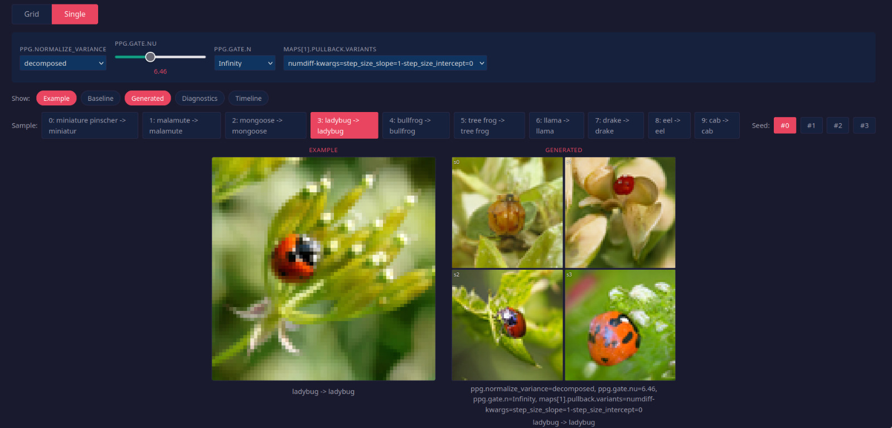

#   Push-Pull Guidance: Image Editing by Pushing-Forward the gradients of Latent Space

<p align="center">
  
</p>

##  Official Pytorch Implemetation of Push-Pull Guidance

*(preprint coming soon)* 


Given an input image, Push-Pull Guidance allows you to generate similar images, by using off the-shelf denoising diffusion models. The method requires no re-training or finetuning and only requires a user to provide an image and indicate how strongly they want the generated images to match the input. 

##  Requirements

Create the conda environment from the provided `requirements.yaml`:

```.bash
conda env create -f requirements.yaml
conda activate edm-cuda
```

The PPG algorithm lives in a git submodule, so clone with `--recurse-submodules`
(or run `git submodule update --init` after cloning).


##  Exploring Different Parameters with Sweep Viewer
We visualize our results using `sweep.py` which calls a config.

```.bash
python sweep.py demo/config.yaml
```

The workload can be distributed across multiple GPUs by running the sweep command using `torchrun`:
```.bash
torchrun --nproc-per-node=4 sweep.py demo/config.yaml
```

### Defining a sweep

A sweep is declared by a YAML config.
 Any field written as a `values:` list (or a `linspace:`) is promoted to a **sweep axis**; the sweep then runs the full Cartesian product of all axes and renders one cell per combination. Scalar fields are held fixed across the whole grid. For more details on configurations look at `sweeper/schema.py`. Below we show a simplified config for doing guidance in pixel space.

```yaml
title: "EDM ImageNet 64x64 — Pixel Guidance Sweep"
output_dir: demo/sweeps/pushpull

model:
  type: edm                      # fixed: same model for every cell

examples:
  samples_yaml: data/imgnet64/my_samples.yaml
  n_entries: 10                  # images to edit
  n_seeds: 4                     # seeds per image

solver:                          # settings for EDM solver
  num_steps: 32
  stochastic: true
  second_order: true

ppg:                             # parameters for push-pull gradient
  mean_scale: ve
  normalize_variance:
    values: [none, decomposed]         # axis (2 values)
  gate:
    type: hill
    nu:
      values: [25.45, 13.26, 10.52, 6.46, 5.0, 2.9, 2.17, 1.61, 0.84]   # axis (9 values)
    n:
      values: [2, .inf]             # axis (2 value)

```


The config above yields a total of `2 x 9 x 2 = 36` cells.
### Browsing the results

Each run writes its images, a `manifest.json`, and a **HTML
viewer** into the designated output directory. Open `viewer.html` to explore the grid interactively. It offers two modes:

- **Grid mode** -- pick any two axes for the rows and columns and filter the
  rest, to compare a 2-D slice of the parameter space at a glance.
- **Single mode** -- focus on one cell with dropdowns/sliders for every axis,
  plus toggleable panels for the input example, baseline, generated output,
  per-step denoising timeline, and diagnostic plots.



##  Calculating Metrics for Different Parameters Settings

The viewer is for qualitative inspection; to evaluate a sweep quantitatively,
`metrics_sweep.py` runs the same parameter grid but, instead of building an HTML
viewer, computes a set of metrics for every cell and writes the results to a CSV.

```.bash
python metrics_sweep.py demo/config.yaml                          # single GPU
```

As with the sweep viewer, the workload distributes across multiple GPUs with
`torchrun` — metrics are accumulated across ranks, so the result is identical to
a single-GPU run:

```.bash
torchrun --nproc-per-node=4 metrics_sweep.py demo/config.yaml     # multi-GPU
```

### Configuring metrics

A metrics config is an ordinary sweep config with a few extra top-level fields
that describe what to measure and where to write it:

```yaml
# ... the same model / examples / ppg / maps blocks as a sweep config ...

ref_stats: data/refs/edm-1-imagnet-64x64.pkl   # reference dataset statistics (for FD)
example_features_dir: data/imgnet64/features   # cached features of the source images
metrics:
  cs: [clip, dinov2, pixel]                    # content similarity to the source
  pr: [dinov2]                                 # precision / recall
output_csv: results/pushpull/metrics.csv       # where the per-cell table is written
output_dir: results/pushpull
n_sample_images: 10                            # sample images to save per cell
```

The `metrics` field maps a **metric type** to the list of **feature extractors**
it should be computed over:

| Type | Meaning | Extractors |
|------|---------|------------|
| `fd` | Fréchet Distance to the reference dataset (à la FID / FD-DINOv2) — overall sample quality | `inception`, `dinov2` |
| `cs` | Mean cosine similarity between each edit and its source image — fidelity to the input | `clip`, `dinov2`, `pixel` |
| `pr` | k-NN precision / recall ([Kynkäänniemi et al., 2019](https://arxiv.org/abs/1904.06991)) | `dinov2` |

Each row of the output CSV is one grid cell (one parameter combination) with a
column per requested `type × extractor`, so you can rank settings or plot a
metric against any swept axis (e.g. content similarity vs. gate steepness `nu`).

##  Preparing the Data

The sweep and metrics scripts read everything from `data/`. The repository ships
the small YAML configs, but the images, reference statistics, and cached features
have to be assembled locally. The layout is:

```
data/
├── refs/                       # reference dataset statistics (for FD)
│   ├── edm-1-imagnet-64x64.pkl
│   └── edm-2-imagenet-64x64.pkl
├── imgnet64/
│   ├── <class_id>/*.png        # validation images, one folder per ImageNet class
│   ├── imgnet_labels.yaml      # class id → human-readable label  (in repo)
│   ├── my_samples.yaml         # hand-picked editing examples     (in repo)
│   └── features/               # cached features (built locally)
│       ├── clip.npy
│       ├── dinov2.npy
│       └── index.csv
├── imgnet512/                  # same structure as imgnet64
└── wild-ti2i/
    ├── data/                   # source images
    ├── wild-ti2i-real.yaml     # real-image editing prompts        (in repo)
    └── wild-ti2i-fake.yaml     # generated-image editing prompts    (in repo)
```

### Reference statistics (`data/refs/`)

The `.pkl` files hold the precomputed Inception/DINOv2 statistics of the
reference dataset used for the Fréchet Distance metric. They come from NVlabs'
[edm](https://github.com/NVlabs/edm) and
[edm2](https://github.com/NVlabs/edm2) repositories — follow their instructions
for computing (or downloading) reference statistics and place the resulting
`.pkl` files here.

### `imgnet64` and `imgnet512`

**Class images.** Each `<class_id>/` folder holds the ImageNet validation
images for that class (e.g. `data/imgnet64/65/0.png`). For building the cropped
64×64 validation set, see this
[Kaggle notebook](https://www.kaggle.com/code/brandonchinalien/download-cropped-validation-set-64x64);
the 512×512 set is assembled the same way at the higher resolution. `imgnet512`
mirrors the `imgnet64` layout exactly.

**`imgnet_labels.yaml`.** The class id → label mapping (`0: "tench, Tinca
tinca"`, …). Shipped in the repo; no action needed.

**`my_samples.yaml`.** A hand-picked set of editing examples referenced by the
sweep configs (`examples.samples_yaml`). Each entry points at one source image
and its source/target labels:

```yaml
- init_img: "data/imgnet64/my_samples/237/21.png"
  source_label: 237
  target_label: 237
```

This file provided to the repo. To curate your own, just list the images you
want to edit in the same format.

**`features/`.** Cached embeddings of the class images, used to compute content
similarity and precision/recall without re-extracting on every run (see
`example_features_dir` in the metrics config). Build them by running each feature
extractor (`clip`, `dinov2`) over the class images and saving one array per
extractor plus an index that maps array rows back to images:

- `clip.npy`, `dinov2.npy` — an `N × D` array, one row per image, in a fixed order.
- `index.csv` — `N` rows of `<class_id>,<image_index>` giving, for each row of
  the feature arrays, which image it was computed from (e.g. `65,0` ↔
  `data/imgnet64/65/0.png`).

### `wild-ti2i`

The image-to-image translation benchmark is taken from the
[Plug-and-Play](https://github.com/MichalGeyer/plug-and-play) repository. Place
its source images under `data/wild-ti2i/data/`. 

##  References
This repository was heavily inspired by the following repositories:
- [Elucidating the Design Space of Diffusion-Based Generative Models](https://github.com/NVlabs/edm/tree/main)
- [EDM2 and Autoguidance](https://github.com/NVlabs/edm2)

##  Acknowledgements


This work was done during an internship at the Generative Memory Lab under the supervision of Luca Ambrogioni. I would also like to thank Dejan Stančević for the many discussions.

